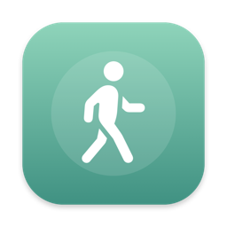
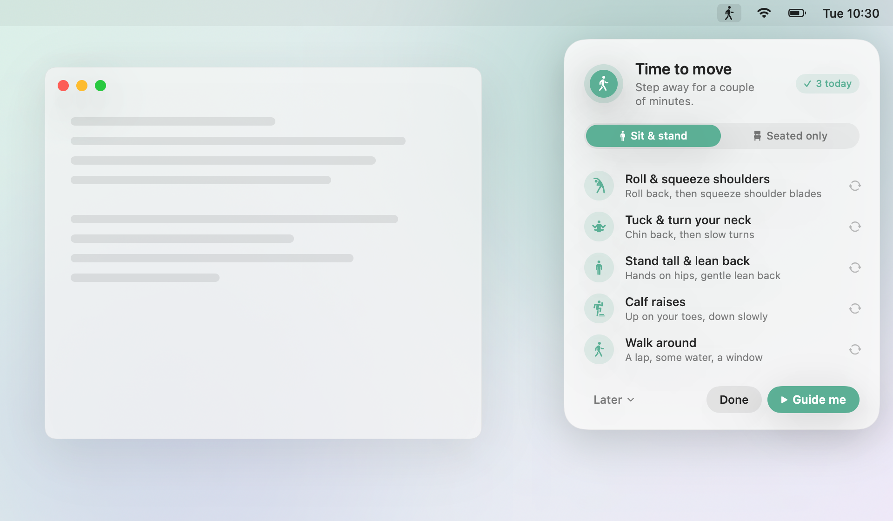
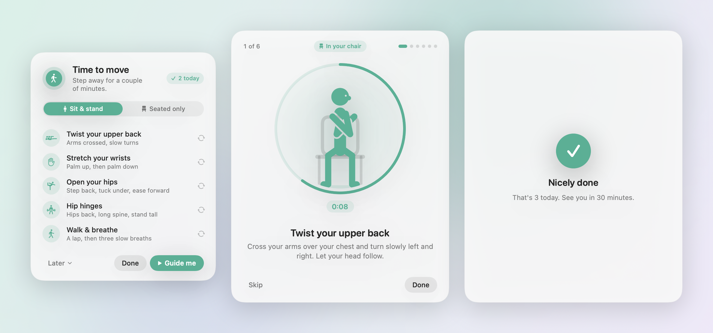

<p align="center">
  
</p>

<h1 align="center">Move</h1>

<p align="center">
  <b>A gentle nudge to get up from your desk every 30 minutes.</b><br>
  A tiny, free menu bar app for macOS. No account, no tracking, no nagging.
</p>

<p align="center">
  <a href="https://github.com/dpappo/move/releases/latest/download/Move.zip"><b>⬇ Download for Mac</b></a>
  &nbsp;·&nbsp; macOS 14 or later &nbsp;·&nbsp; Apple silicon & Intel
</p>

<p align="center">
  <picture>
    <source media="(prefers-color-scheme: dark)" srcset="docs/screenshots/hero-dark.png">
    
  </picture>
</p>

Sitting for hours is rough on your back, neck and focus. Most break timers fix that by getting in your way: full-screen overlays, sounds, stolen keyboard focus mid-sentence.

Move does it quietly instead. A small card slides into the corner of your screen and waits. It never takes focus, so you can finish your thought, then step away. If you want a hand, it walks you through a 3-minute routine designed for desk workers.

## Why you'll like it

- **Never interrupts.** The card floats in the corner and doesn't steal focus from what you're typing.
- **Knows when you've already had a break.** Step away for 5+ minutes or close the lid, and the timer starts over on its own.
- **Follows along with you.** A guided routine with a timer and soft chimes, so you don't have to think about what to do.
- **Waits out your meetings.** Move holds the reminder until your meeting ends, using your Google (or any) calendar.
- **Respects your evenings.** By default it only reminds you Monday to Friday, 9 to 6.
- **Tiny and private.** A 2 MB app with no network access and no analytics. Your settings and calendar stay on your Mac.

## Install

**The quick way.** Paste this into Terminal:

```bash
curl -fsSL https://raw.githubusercontent.com/dpappo/move/main/scripts/install.sh | bash
```

It downloads the latest release into your Applications folder and opens it. Look for the walking figure in your menu bar.

**Or download it yourself.**

1. Download [**Move.zip**](https://github.com/dpappo/move/releases/latest/download/Move.zip) and unzip it.
2. Drag **Move.app** into your **Applications** folder.
3. Open it. macOS will warn you that the app isn't from the App Store. Open **System Settings → Privacy & Security**, scroll down, and click **Open Anyway**. You only need to do this once.

If macOS says the app "is damaged and can't be opened", run `xattr -dr com.apple.quarantine /Applications/Move.app` in Terminal, then open it again.

> Why the warning? Move is free and open source, so it isn't signed with a paid Apple Developer certificate. You can read every line of code here, or build it yourself (see below).

## How to use it

### 1. When it's time to move

Every 30 minutes, a card appears in the top-right corner. Pick one:

| Button | What it does |
| --- | --- |
| **Sit & stand** / **Seated only** | Choose whether the routine gets you on your feet, or stays in your chair (say, at a table with colleagues). Move remembers your choice |
| **Swap** (↻ beside a movement) | Not up for one? Swap it for something else you can do in the same spot: a chair movement for another chair movement, an on-your-feet one for another. Keep clicking to go through them all |
| **Guide me** | Moves the card to the middle of your screen and walks you through the routine: about 3 minutes, or 2 if you're staying seated |
| **Done** | You moved on your own. See you in 30 minutes |
| **Later** | Snooze for 2, 5, 10, or 15 minutes |

You can drag the card anywhere. It shows up on every Space, even over full-screen apps.

### 2. The guided routine

<picture>
  <source media="(prefers-color-scheme: dark)" srcset="docs/screenshots/flow-dark.png">
  
</picture>

When you start the guide, the card glides to the middle of your screen and grows so you can follow along from a step back. Each step has a countdown ring, a short cue, and an animated figure acting out the movement, plus a badge that tells you whether you're in your chair or on your feet. A soft chime marks the next step, and you can **Skip** a step or tap **Done** to finish early.

Every routine starts with what you can do in your chair, then tells you when to stand up for the rest. Three routines take turns from one break to the next, so it doesn't get stale:

| | Stand & stretch | Reach & rise | Twist & hinge |
| --- | --- | --- | --- |
| **In your chair** | Roll & squeeze shoulders | Ease your neck | Twist your upper back |
| | Tuck & turn your neck | Reach & side bend | Stretch your wrists |
| **Stand up** | Stand up | Sit to stand | Stand up |
| **On your feet** | Stand tall & lean back | Open your chest | Open your hips |
| | Calf raises | | Hip hinges |
| | Walk around (90 s) | Take a longer walk (90 s) | Walk & breathe (90 s) |

Can't get up right now? Pick **Seated only** on the card and the routine stays in your chair the whole time. These are small enough to do at a table with other people, and still get your legs moving under the desk:

| Loosen up | March & reach | Twist & tap |
| --- | --- | --- |
| Roll & squeeze shoulders | Ease your neck | Twist your upper back |
| Tuck & turn your neck | Reach & side bend | Stretch your wrists |
| Round & arch your back | March in your chair | Roll & squeeze shoulders |
| Heel & toe lifts | Straighten your legs | Heel & toe lifts |
| Straighten your legs | Round & arch your back | March in your chair |

### 3. The menu bar

Click the walking figure in your menu bar to see when your next break is and how many you've taken today. From there you can:

| Menu item | What it does |
| --- | --- |
| **Move Now** (⌘M) | Show the card right away |
| **Pause** | Take a break from reminders for 30 minutes, 1 hour, 2 hours, or until tomorrow |
| **Remind Every** | Choose 30, 45 or 60 minutes |
| **Only During Work Hours** | Remind only Monday to Friday, 9:00 to 18:00 (on by default) |
| **Not During Meetings** | Hold the reminder until your meeting ends (on by default, asks for calendar access) |
| **Soft Chimes in Guide** | Turn the step chimes on or off |
| **Open at Login** | Start Move with your Mac (on by default) |

When reminders are paused, the walking figure changes to a standing one.

### 4. Meetings

With **Not During Meetings** on, Move checks your calendar before it taps you on the shoulder. If you're in a meeting when a break comes due, it waits and shows the card once the meeting ends. If the card is already up and untouched when a meeting starts, it slips away and comes back afterwards. Sitting still on a call doesn't count as a break, either.

Move reads the calendars in the Mac's **Calendar** app, so there's nothing to sign in to and nothing leaves your Mac. To use your Google Calendar, add your Google account in **System Settings → Internet Accounts** and make sure **Calendars** is switched on. Outlook, iCloud and Exchange calendars work the same way.

The first time you open Move, it asks for access to your calendars. If you say no, the feature stays off until you allow it in **System Settings → Privacy & Security → Calendars**.

An event counts as a meeting when more than one person is invited, so blocks you put on your own calendar, like focus time or lunch, don't hold your reminders. Move ignores all-day events, meetings you've declined, and read-only calendars like a teammate's calendar you've subscribed to.

### Uninstall

Choose **Quit Move** from the menu, then drag **Move.app** from Applications to the Trash.

## Build from source

You'll need Xcode or the Xcode command line tools on macOS 14 or later.

```bash
git clone https://github.com/dpappo/move.git
cd move
./scripts/build.sh --install
```

That builds `Move.app`, copies it to `/Applications`, and opens it. On macOS 26 the card uses Liquid Glass.

## Contributing

Issues and pull requests are welcome. The whole app is about two thousand lines of Swift in [`Sources/Move`](Sources/Move).

The screenshots above are rendered from the app's real SwiftUI views, so they never fall out of date. To have them refresh automatically, turn on the repo's git hooks once:

```bash
git config core.hooksPath .githooks
```

From then on, every `git push` re-renders `docs/screenshots`. If the UI changed, the hook commits the new screenshots and asks you to push again. You can also render them by hand with `./scripts/screenshots.sh`, or skip the hook once with `SKIP_SCREENSHOTS=1 git push`.

To publish a release, push a version tag such as `git tag v1.1 && git push origin v1.1`. GitHub Actions builds a universal app and attaches `Move.zip` to the release, which is what the download links and install script use.
